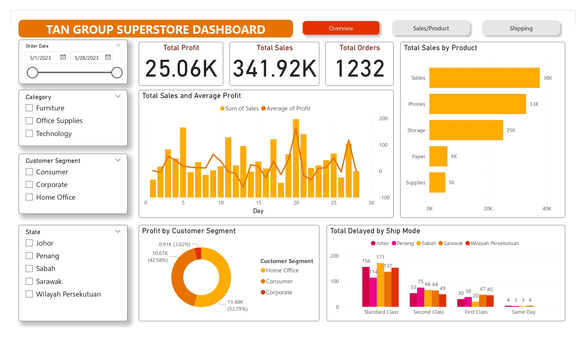
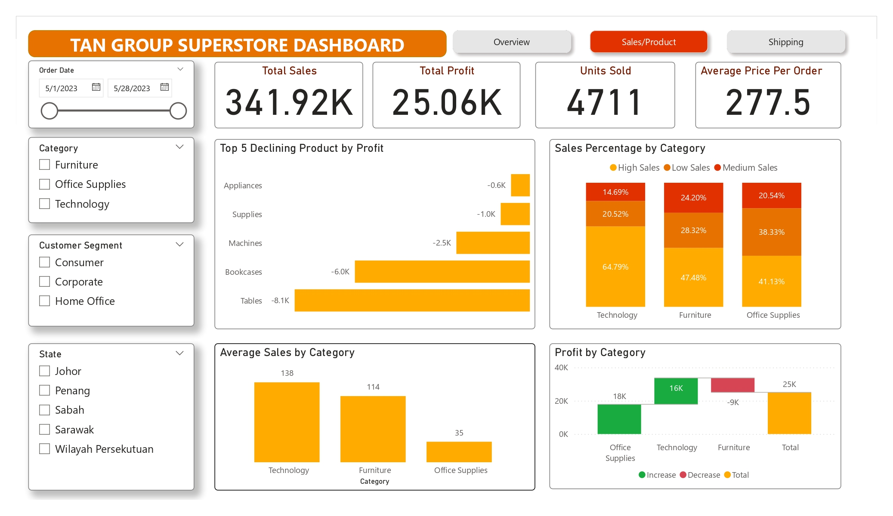
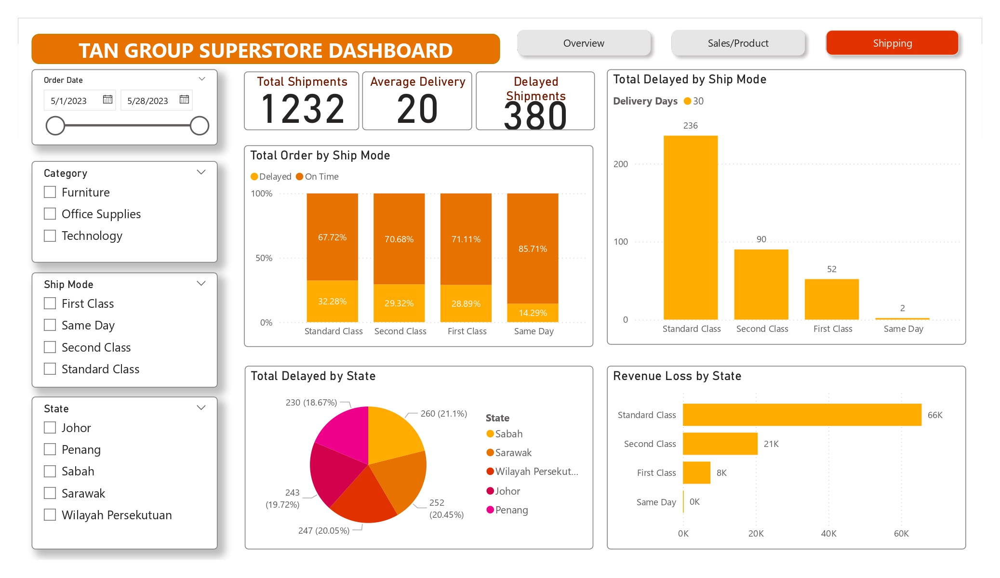

# 🚚 Shipping & Sales Performance Dashboard

**Duration:** May 2025  
**Associated with:** Excelerate (K-Youth Data Analytics Programme)

---

## 📘 Overview
This Power BI project was developed to help a mid-sized retail company identify **key business insights** and uncover the **root causes of delayed deliveries**.  
The dashboard supports **upper management**, **sales/product teams**, and **logistics departments** in making **data-driven decisions**.

---

## 🎯 Objectives
- Analyze overall **sales and profit performance**
- Track **delivery delays** by state, shipping method, and category
- Identify **top-performing and underperforming products**
- Measure **average delivery time** across shipping methods
- Highlight **operational inefficiencies** impacting customer satisfaction

---

## 📊 Analysis Questions
1. Which product is generating the highest sales and profit?  
2. What is the sales trend across time, states, and categories?  
3. Which products have declining performance?  
4. Which product categories are most profitable?  
5. Which shipping methods have had the highest rate of delayed deliveries in the past month?  
6. What is the average delivery time for each shipping method?  
7. Which state experiences the most frequent shipping delays?  
8. Which customer segments generate the highest profit margins?  
9. Where are we losing revenue due to delays or returns?  
10. What are the key operational inefficiencies affecting customer satisfaction?

---

## 📈 Key Features
- Interactive visuals built with **Power BI**
- Dynamic filters by **state**, **category**, and **shipping mode**
- KPIs for **sales, profit, delivery time, and delay rates**
- Trend analysis for **sales performance over time**
- Drill-down functionality for detailed insights

---

## 🧠 Tools & Skills Used
- **Power BI** – data modeling, DAX, dashboard design  
- **Excel** – data cleaning and preparation  
- **Data Analysis** – identifying trends, performance issues, and root causes

---

## 📷 Dashboard Preview
| Overview | Sales Analysis | Shipping Insights |
|-----------|------------------|----------------|
|  |  |  |

